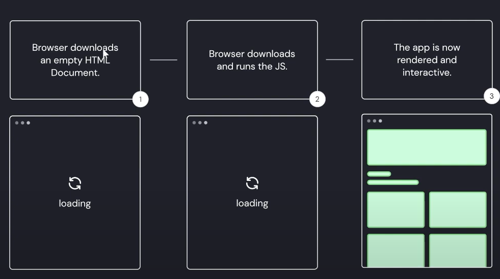
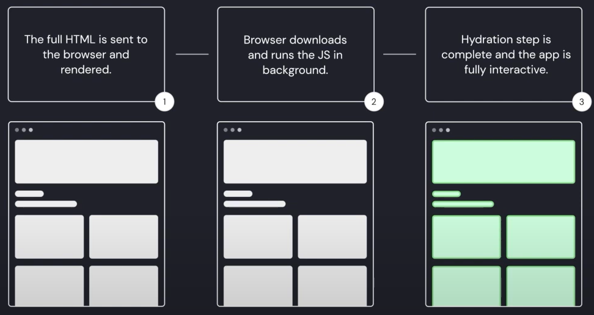

# Web rendering (client, server, static, hybrid)

## CSR Client Side Rendering

-Less good for SEO (does not get content)

Context of usage : **Single Page Application**, only one page (one javascript) that manages the navigation  

Example of framework associated : Vue.js, React

## SSR Server Side Rendering

+Better for SEO (full rendering)

## SSG Static Site Generation

Rendering make at **build step** (rendering neither client or server sides). HTML always the same static. No actualisation

+Fast 

-Not dynamic (need one rebuild to change render)

Example use case : Portfolio

## Hybrid

Mix between client/server/static to meet specific needs : time, freshness, rendering, rooting, etc. Require an adapted host for running. 

Example of framework associated : Next.js (ISR Incremental Static Regeneration), Nuxt 3 (ISG Incremental Static Generation)
